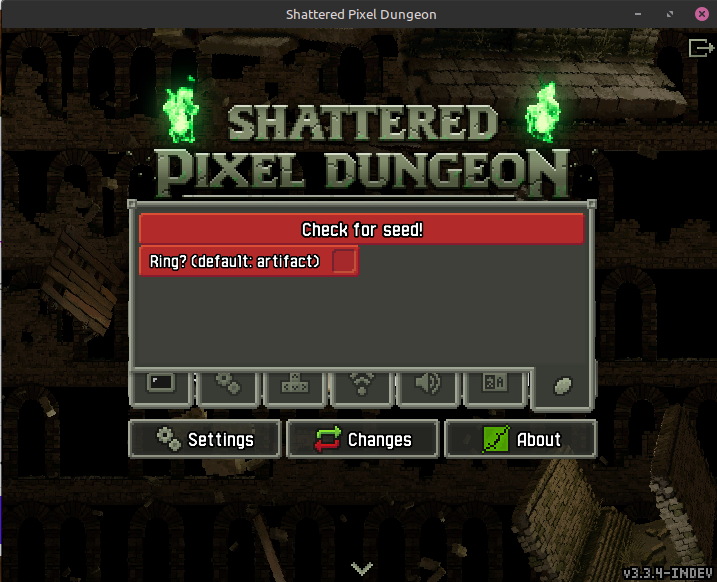
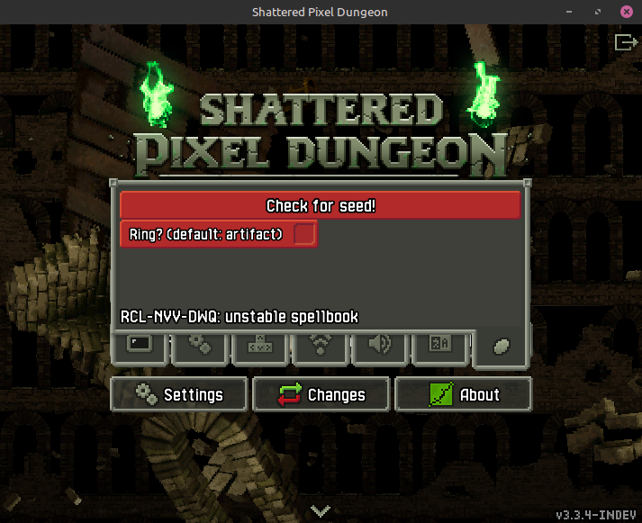
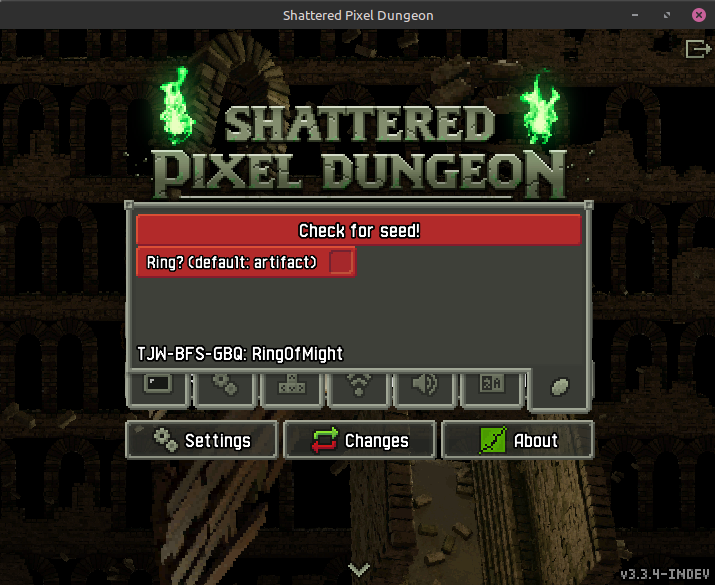

# Seed checker
This little patch adds the capability to generate artifact/ring seeds ingame.  
You only need the [original code](https://github.com/00-Evan/shattered-pixel-dungeon), apply the patch and you are set to go.

This feature tries to keep the original balance ideas of the game, i.e. you won't get the full stack of items for all the levels but it only checks for the first level and one artifact/ring.
Similarly to the "Custom Seed" feature, the seed checker is not unlocked by default, you have to beat the game first (or build it in debug).





# How to apply the patch
Download the patch and the [original code](https://github.com/00-Evan/shattered-pixel-dungeon), apply the patch via git.  
On Linux:

```terminal
wget https://raw.githubusercontent.com/flaszlo2000/spd_seed_checker/refs/heads/main/seed_checker.patch
git clone --depth 1 https://github.com/00-Evan/shattered-pixel-dungeon.git
cd shattered-pixel-dungeon
git apply ../seed_checker.patch
```

If you don't see any differences in the settings tab then most probably you have not beaten the game yet (hence do not have the badge for it which this patch checks)

# Credits
For [Evan](https://github.com/00-Evan) for updating this amaizing game.  
Fot [Astley]() for not letting us down.
